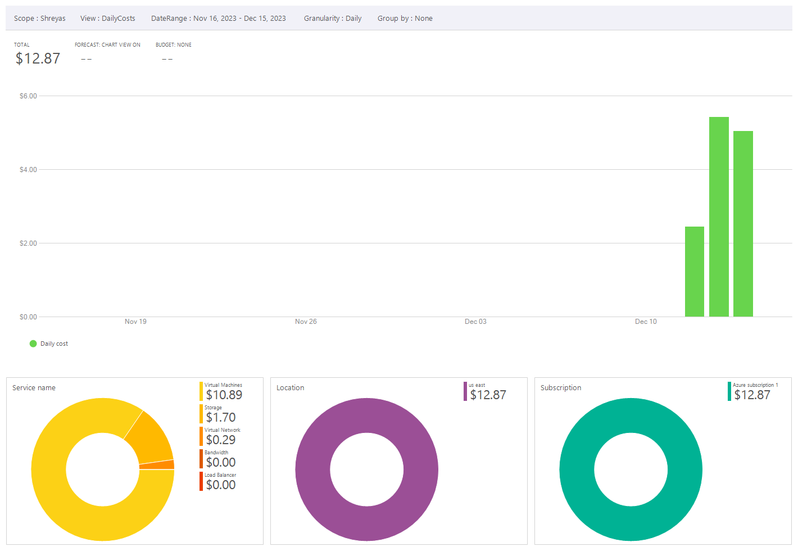
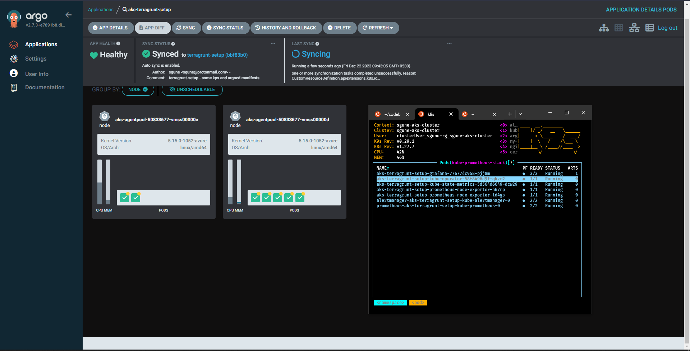

# aks
Code and instructions to use AKS (free tier)

# Starters
In the docs dir, you will find a few readmes that will give you a few initial steps to get started.

I've added individual readme markdowns to each section where I could go in and add stuff in realtime so this readme doesn't get ridiculously huge.

Some highlights are as follows:

-  openTofu compliant :heavy_check_mark:
-  Terragrunt compliant :heavy_check_mark:
-  Azure Kubernetes Service :heavy_check_mark:
-  Cert-Manager :heavy_check_mark:
    -  ACME resolver :heavy_check_mark:
    -  DNS01 complaint with Azure DNS :heavy_check_mark:
    -  Ingress Shim compliant :heavy_check_mark:
    -  Autorenewal :heavy_check_mark: 
- Nginx Ingress :heavy_check_mark:
- Github Actions :heavy_check_mark:
- Helm based bootstrapping :heavy_check_mark:
- ArgoCD :heavy_check_mark:
- KPS (as a test-app for ArgoCD ) :heavy_check_mark:
- Vault (as a test-app for ArgoCD)
- 

# Cost
In the cost-analysis dir, there's some rudimentary cost-analysis of a simple AKS cluster, running for 3 days. I wouldn't advise extrapolating any cost data out of it as I was bound by the $200 credit limitations. But I think that the Azure charts and cost data is neat.

# ArgoCD Success
