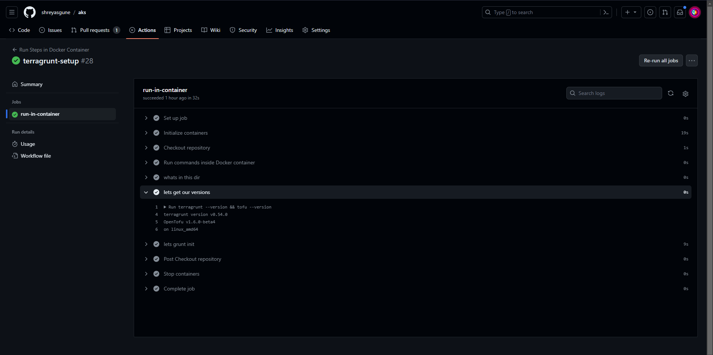

# aks
Code and instructions to use AKS (free tier)

# Starters
In the docs dir, you will find a few readmes that will give you a few initial steps to get started.

I've added individual readme markdowns to each section where I could go in and add stuff in realtime so this readme doesn't get ridiculously huge.

# Project Highlights

-  openTofu compliant :heavy_check_mark:
-  Terragrunt compliant :heavy_check_mark:
-  [Docker Image](https://hub.docker.com/repository/docker/shreyasgune/gman-tofu) with all azure, terragrunt and tofu baked in :heavy_check_mark:
-  Azure Kubernetes Service :heavy_check_mark:
-  Cert-Manager :heavy_check_mark:
    -  ACME resolver :heavy_check_mark:
    -  DNS01 complaint with Azure DNS :heavy_check_mark:
    -  Ingress Shim compliant :heavy_check_mark:
    -  Autorenewal :heavy_check_mark: 
- Nginx Ingress :heavy_check_mark:
- Hello Web App :heavy_check_mark:
    - TLS enabled :heavy_check_mark:
    - Cert-Manager ... managed TLS :heavy_check_mark:
    - Ingress enabled: :heavy_check_mark:
- Github Actions :heavy_check_mark:
- Helm based bootstrapping :heavy_check_mark:
- ArgoCD :heavy_check_mark:
- Kube Prometheus Stack (as a test-app for ArgoCD ) :heavy_check_mark:
- Vault (as a test-app for ArgoCD) :heavy_check_mark:
- Azure Service Operator (install only) :heavy_check_mark:
- Azure Managed Secrets :heavy_check_mark:
    - csi-secrets-store-provider-azure :heavy_check_mark:
    - secrets-provider-class :heavy_check_mark:
    - secrets-mounted-on-test-pod :heavy_check_mark:

# Cost
In the cost-analysis dir, there's some rudimentary cost-analysis of a simple AKS cluster, running for 3 days. I wouldn't advise extrapolating any cost data out of it as I was bound by the $200 credit limitations. But I think that the Azure charts and cost data is neat.

# Github Actions Success

# Azure Kubernetes Cluster Success

# ArgoCD Success

# Gman-Tofu
Docker image you can pull down to do your terragrunt and azure activities using openTofu
https://hub.docker.com/repository/docker/shreyasgune/gman-tofu

`shreyasgune/gman-tofu:0.1`

# Coming Soon in 2024     
- Azure Active Directory pod-managed identities in AKS
- Automation of the following using OpenTofu and Terragrunt
    - Service Principals
    - Managed Identities
    - Resource Groups
    - Record Set Management
    - Storage Account Management
    - Storage Container Management
    - Networking and Firewall Rules
    - NFS and Archival storage solutions
    - Workload Identity
    - Azure Services (only after Azure Service Operators are installed and configured)
    - Azure Security Center and Policies for AKS
- Azure Service Operators (config and usage)
- Azure Functions
    - serverless
    - https triggered
    - queue triggered
- Advanced CI/CD with Github Actions